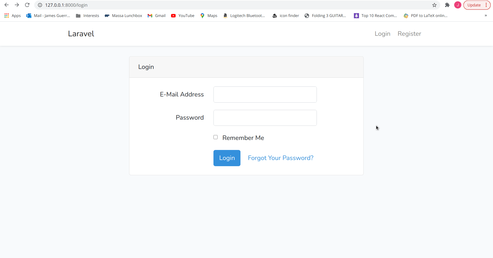

# Todo App
The purpose of this application is to showcase my first Laravel App.

If you are to use this app, please follow the instructions below. 

# App Functionality



# Configuring App to Run

First `cd` into your app directory

rename `.env.example` to `.env`

Go to `.env` file and change `DB_CONNECTION=mysql` to `DB_CONNECTION=sqlite`


And run the following commands

```
touch database/database.sqlite
composer install
php artisan key:generate
php artisan migrate
php artisan serve
```

